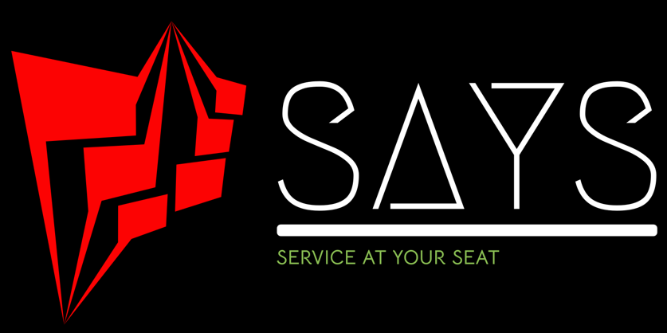

<h1 align="center">Service At Your Seat</h1>
<h3 align="center">The application will allow users to book cinema tickets with ease and also contains added cool features</h3>
<h4 align="center">You can visit our website at <a href="https://service-at-your-seat.vercel.app/" target="blank">https://simple-movie-explorer.vercel.app</a></h3>


<h2 align="left">Tech Stack and Tools :</h2>
<h3 align="right">Logo Design</h3>


<p align="left">
<a href="https://reactjs.org/" target="_blank" rel="noreferrer">  </a>
<a href="https://tailwindcss.com/" target="_blank" rel="noreferrer">  </a>
<a href="https://getbootstrap.com" target="_blank" rel="noreferrer">  </a>
<a href="https://nodejs.org" target="_blank" rel="noreferrer">  </a>
<a href="https://expressjs.com" target="_blank" rel="noreferrer">  </a>

<a href="https://www.mongodb.com/" target="_blank" rel="noreferrer">  </a>
<a href="https://developer.mozilla.org/en-US/docs/Web/JavaScript" target="_blank" rel="noreferrer">  </a>
<a href="https://git-scm.com/" target="_blank" rel="noreferrer">  </a>

<a href="https://postman.com" target="_blank" rel="noreferrer">  </a>
<a href="https://vercel.com" target="_blank" rel="noreferrer">  </a>
<a href="https://render.com" target="_blank" rel="noreferrer">  </a>
</p>


<h2 align="left">Features</h2>

<h3 align="left">Multiple Dashboards</h3>

<h3 align="left">Client : </h3> 

- Book Cinema Tickets

- Order snacks from the seat

- Movie Reviews

- Explore theatres, based on location

- Theatre Reviews

- Website complaints

- Fascinating news related to movies

<h3 align="left">Theatre : </h3>

- Rent movies to play in theatre

- Add or remove a movie from theatre

- Screen Seating Arrangement

- Schedule shows

- Add or remove Snacks

- Maintain theatre profile

- Observe theatre reviews

<h3 align="left">Admin:</h3>

- Theatre Verification

- Announcements through Mass Mailing
  
- Add movies for rental purposes
  
- Remove any user

- Remove any theatre
  
- Consider Website Reviews

<h3 align="center"> General Features </h3> 

- Login and Register, **Users and theatres can login and register**

- Clean code and structure, **Well organised code, using MVC and REST Architecture in the server**

- **Well designed and cool,interactive UI**

- **Deployed both Frontend and Backend, on Vercel and Render respectively**

- Included various Third-party Libraries,**Express,Mongoose,dotenv,Morgan,CORS,Concurrently etc.**

<h2 align="left">Website Video</h2>

- Presented here is a brief overview video of our website, providing insights into its some of the functionalities and design.

- Please take a moment to watch and gain an understanding of the platform's offerings.

- For a more comprehensive understanding, please explore the website directly at https://service-at-your-seat.vercel.app

  
https://github.com/user-attachments/assets/e12361c7-7af9-4a3a-85d1-58417c3daa9b


<h2 align="left">Installation</h2>
<h3 align="center">To get started with this project, clone the repository or download the zip file.</h3>
<h4 align="center">Install the necessary dependencies</h4>

```bash
# Clone the repository
git clone https://github.com/staion1504/Service-At-Your-Seat.git

# Navigate to the project directory
cd Service-At-Your-Seat-main

# Install dependencies
npm install

# Run the code
npm run watch
```


<h2 align="left">Fellow Team Members</h2>

- Rupesh Chowdary Peddineni 
- Saiteja Pagilla
- Arun Koushik
- Kusuma Teki
- Mukesh

<h2 align="left">Contact Us</h2>

- 📫 You can to reach us by mailing to **rupesh.p21@iiits.in** or **saiteja.p21@iiits.in** or **rupeshprofessional2728@gmail.com**

- 👨‍💻 Project is available at [https://github.com/staion1504/Service-At-Your-Seat.git]
  


